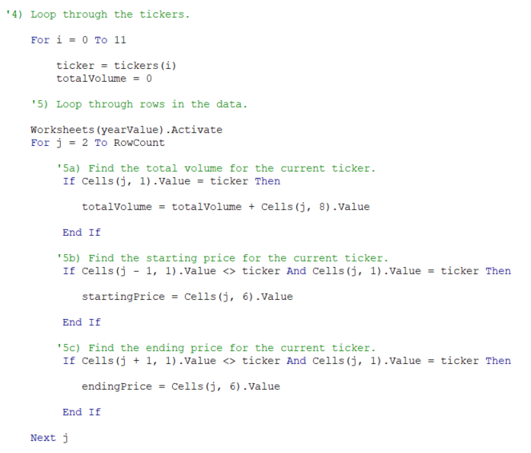

# Analyzing Stock Data with VBA

## Overview of Project
My friend Steve loves the workbook I prepared for him to help his parents analyze the performance of a dozen stocks in 2017 and 2018. Now, he wants me to help expand his initial research to include data from the entire stock market over the last few years.

### Purpose of analysis
Although the original code I prepared works well for a dozen stocks, it might not work as well for thousands of stocks like Steve wants. And if it does, it may take a long time to execute the script. Therefore the purpose of this project is to refactor the existing code and see if I can make it run more efficiently by measuring its performance against the original script's performance.

## Results
In order to make the code run more efficiently, I needed to switch the nesting order of the `for` loops. To achieve this, I first created a variable called the `tickerIndex` that accessed the correct index across the `tickers` array as well as the 3 new output arrays I created next: `tickerVolumes`, `tickerStartingPrices`, and `tickerEndingPrices`. Setting up the `tickerIndex` variable meant the code was able to assign the `tickerVolumes`, `tickerStartingPrices`, and `tickerEndingPrices` to each ticker symbol before looping through the entire dataset. Refactoring the code in this manner allowed it to run much faster than using the original script.

### Key Differences of Original vs. Refactored Scripts

To help explain the differences between the original and refactored scripts, let's take a look at the code. In the original code below, we see that the script first loops through the tickers and then loops through all the rows in the dataset:

However, in the refactored code below, we see that the `tickerIndex` variable assigns the new output arrays (`tickerVolumes`, `tickerStartingPrices`, and `tickerEndingPrices`) to the ticker symbol first and then loops over the rows in the dataset. This key difference enables our refactored script to run faster.

The full workbook with original and refactored scripts can be found here: [VBA Challenge](VBA_Challenge.xlsm)

### Run-Times for the Original vs. Refactored Scripts

The run-times for the original script for 2017 and 2018 were as follows:

Whereas, the run-times for the refactored script for 2017 and 2018 were as follows:

Comparing the sets of screenshots above, we can see that the refactored code runs about 0.5 seconds faster than the original code. 

## Summary

### General Advantages and Disadvantages of refactoring code
In general terms, there are several advantages to refactoring code. It can help uncover programming bugs, makes programs run faster, and it's easier to understand and interpret the code. Two disadvantages of refactoring code is it can be time consuming and also requires a lot of skill and discipline.

### Pros and Cons to refactoring the original VBA script
As for this challenge assignment specifically, refactoring the original VBA script definitely increased its efficiency and run-time performance. However, refactoring the code was time consuming and since I lack programming knowledge and skill, when there were syntax errors, it was challenging for me to debug the code.
